---
## Front matter
title: "Лабораторная работа №5"
subtitle: "Основы работы с
Midnight Commander (mc). Структура программы на
языке ассемблера NASM. Системные вызовы в ОС
GNU Linux"
author: "Комкова Виктория Руслановна"

## Generic otions
lang: ru-RU
toc-title: "Содержание"

## Bibliography
bibliography: bib/cite.bib
csl: pandoc/csl/gost-r-7-0-5-2008-numeric.csl

## Pdf output format
toc: true # Table of contents
toc-depth: 2
lof: true # List of figures
lot: true # List of tables
fontsize: 12pt
linestretch: 1.5
papersize: a4
documentclass: scrreprt
## I18n polyglossia
polyglossia-lang:
  name: russian
  options:
	- spelling=modern
	- babelshorthands=true
polyglossia-otherlangs:
  name: english
## I18n babel
babel-lang: russian
babel-otherlangs: english
## Fonts
mainfont: IBM Plex Serif
romanfont: IBM Plex Serif
sansfont: IBM Plex Sans
monofont: IBM Plex Mono
mathfont: STIX Two Math
mainfontoptions: Ligatures=Common,Ligatures=TeX,Scale=0.94
romanfontoptions: Ligatures=Common,Ligatures=TeX,Scale=0.94
sansfontoptions: Ligatures=Common,Ligatures=TeX,Scale=MatchLowercase,Scale=0.94
monofontoptions: Scale=MatchLowercase,Scale=0.94,FakeStretch=0.9
mathfontoptions:
## Biblatex
biblatex: true
biblio-style: "gost-numeric"
biblatexoptions:
  - parentracker=true
  - backend=biber
  - hyperref=auto
  - language=auto
  - autolang=other*
  - citestyle=gost-numeric
## Pandoc-crossref LaTeX customization
figureTitle: "Рис."
tableTitle: "Таблица"
listingTitle: "Листинг"
lofTitle: "Список иллюстраций"
lotTitle: "Список таблиц"
lolTitle: "Листинги"
## Misc options
indent: true
header-includes:
  - \usepackage{indentfirst}
  - \usepackage{float} # keep figures where there are in the text
  - \floatplacement{figure}{H} # keep figures where there are in the text
---

# Цель работы

Приобретение практических навыков работы в Midnight Commander. Освоение инструкций
языка ассемблера mov и int.

# Задание

1. Откройте Midnight Commanderuser@dk4n31:~$ mc
2. С помощью функциональной клавиши F7 создайте папку lab05 и перейдите
в созданный каталог.
3. Пользуясь строкой ввода и командой touch создайте файл lab5-1.asm 
4. Откройте файл lab5-1.asm и введите текст из листинга 5.1
5. С помощью функциональной клавиши F3 откройте файл lab5-1.asm для просмотра.
Убедитесь, что файл содержит текст программы.
6. Оттранслируйте текст программы lab5-1.asm в объектный файл. Выполните компо-
новку объектного файла и запустите получившийся исполняемый файл.
7. Скопируйте файл in_out.asm в каталог с файлом lab5-1.asm с помощью
функциональной клавиши F5.
8. С помощью функциональной клавиши F6 создайте копию файла lab5-1.asm с именем
lab5-2.asm. Выделите файл lab5-1.asm, нажмите клавишу F6 , введите имя файла
lab5-2.asm и нажмите клавишу Enter
9. Исправьте текст программы в файле lab5-2.asm с использование подпрограмм из
внешнего файла in_out.asm (используйте подпрограммы sprintLF, sread и quit) в
соответствии с листингом 5.2. Создайте исполняемый файл и проверьте его работу.
10. Выполнить самостоятельную работу.

# Теоретическое введение

Здесь описываются теоретические аспекты, связанные с выполнением работы.

Например, в табл. [-@tbl:std-dir] приведено краткое описание стандартных каталогов Unix.

: Описание некоторых каталогов файловой системы GNU Linux {#tbl:std-dir}

| Имя каталога | Описание каталога                                                                                                          |
|--------------|----------------------------------------------------------------------------------------------------------------------------|
| `/`          | Корневая директория, содержащая всю файловую                                                                               |
| `/bin `      | Основные системные утилиты, необходимые как в однопользовательском режиме, так и при обычной работе всем пользователям     |
| `/etc`       | Общесистемные конфигурационные файлы и файлы конфигурации установленных программ                                           |
| `/home`      | Содержит домашние директории пользователей, которые, в свою очередь, содержат персональные настройки и данные пользователя |
| `/media`     | Точки монтирования для сменных носителей                                                                                   |
| `/root`      | Домашняя директория пользователя  `root`                                                                                   |
| `/tmp`       | Временные файлы                                                                                                            |
| `/usr`       | Вторичная иерархия для данных пользователя                                                                                 |

Более подробно про Unix см. в [@tanenbaum_book_modern-os_ru; @robbins_book_bash_en; @zarrelli_book_mastering-bash_en; @newham_book_learning-bash_en].

# Выполнение лабораторной работы

1. Создаем каталог для работы с программами на языке ассемблера NASM.

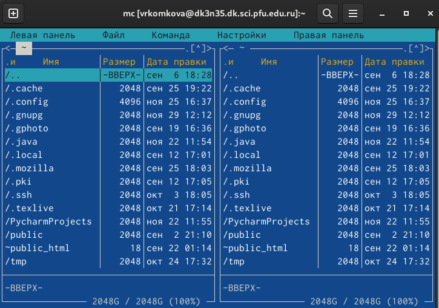{#fig:001 width=70%}

2. С помощью функциональной клавиши F7 создаём папку lab05.

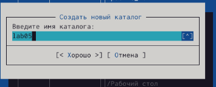{#fig:002 width=70%}

3. Пользуясь строкой ввода и командой touch создадим файл lab5-1.asm.

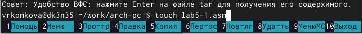{#fig:003 width=70%}

4. Откроем файл lab5-1.asm и введём текст из листинга 5.1

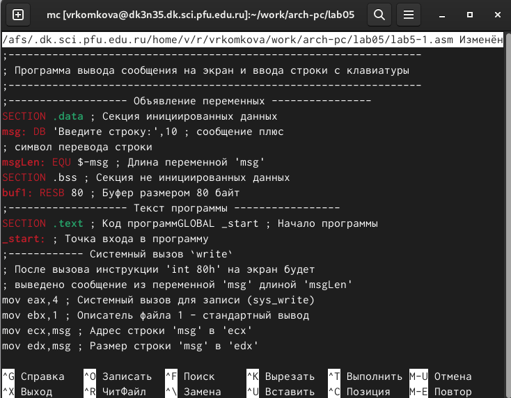{#fig:004 width=70%}

5. С помощью функциональной клавиши F3 откроем файл lab5-1.asm для
проверки наличия текста.

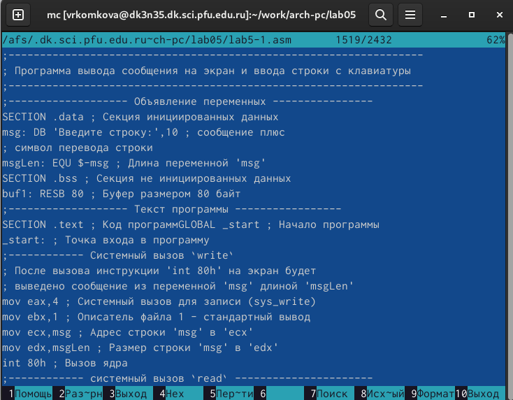{#fig:005 width=70%}

6. Оттранслируем текст программы lab5-1.asm в объектный файл

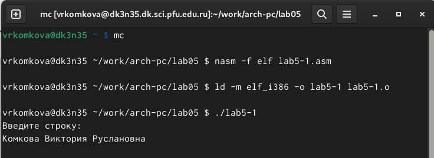{#fig:006 width=70%}

7. Скопируем файл in_out.asm в каталог с файлом lab5-1.asm с помощью
функциональной клавиши F5.

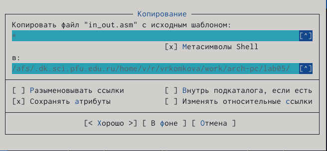{#fig:007 width=70%}

8. С помощью функциональной клавиши F6 создадим копию файла lab5-
1.asm с именем lab5-2.asm.

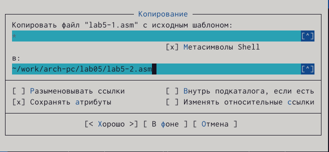{#fig:008 width=70%}

9. Оттранслируем текст программы lab5-2.asm в объектный файл и проверим
его работоспособность

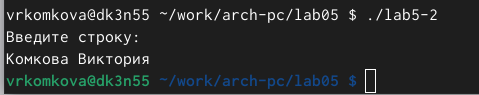{#fig:009 width=70%}

10. Выполним самостоятельную работу

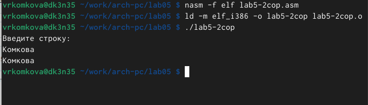{#fig:010 width=70%}

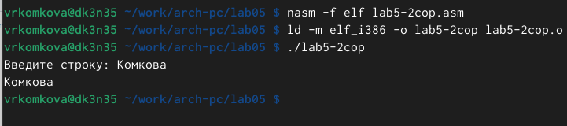{#fig:011 width=70%}

# Выводы

В ходе лабораторной работы я приобрела практические навыки
работы в Midnight Commander, а также освоила инструкции языка ассемблера
mov и int. Я научилась работать с MC, и с его помощью работать с файлами (Со-
здание, переименовывание, копирование, перемещение, удаление, и тд.)

# Список литературы{.unnumbered}

::: {#refs}
:::
