---
## Front matter
title: "Шаблон отчёта по лабораторной работе"
subtitle: "Арифметические операции в NASM"
author: "Комкова Виктория Руслановна"
## Generic otions
lang: ru-RU
toc-title: "Содержание"

## Bibliography
bibliography: bib/cite.bib
csl: pandoc/csl/gost-r-7-0-5-2008-numeric.csl

## Pdf output format
toc: true # Table of contents
toc-depth: 2
lof: true # List of figures
lot: true # List of tables
fontsize: 12pt
linestretch: 1.5
papersize: a4
documentclass: scrreprt
## I18n polyglossia
polyglossia-lang:
  name: russian
  options:
	- spelling=modern
	- babelshorthands=true
polyglossia-otherlangs:
  name: english
## I18n babel
babel-lang: russian
babel-otherlangs: english
## Fonts
mainfont: IBM Plex Serif
romanfont: IBM Plex Serif
sansfont: IBM Plex Sans
monofont: IBM Plex Mono
mathfont: STIX Two Math
mainfontoptions: Ligatures=Common,Ligatures=TeX,Scale=0.94
romanfontoptions: Ligatures=Common,Ligatures=TeX,Scale=0.94
sansfontoptions: Ligatures=Common,Ligatures=TeX,Scale=MatchLowercase,Scale=0.94
monofontoptions: Scale=MatchLowercase,Scale=0.94,FakeStretch=0.9
mathfontoptions:
## Biblatex
biblatex: true
biblio-style: "gost-numeric"
biblatexoptions:
  - parentracker=true
  - backend=biber
  - hyperref=auto
  - language=auto
  - autolang=other*
  - citestyle=gost-numeric
## Pandoc-crossref LaTeX customization
figureTitle: "Рис."
tableTitle: "Таблица"
listingTitle: "Листинг"
lofTitle: "Список иллюстраций"
lotTitle: "Список таблиц"
lolTitle: "Листинги"
## Misc options
indent: true
header-includes:
  - \usepackage{indentfirst}
  - \usepackage{float} # keep figures where there are in the text
  - \floatplacement{figure}{H} # keep figures where there are in the text
---

# Цель работы

Освоение арифметических инструкций языка ассемблера NASM.

# Задание

1. Создать каталог для программ лабораторной работы № 6.
2. Создать файл lab6-1.asm и ввести в файл lab6-1.asm текст программы из листинга 6.1. Создать исполняемый файл и запустить его.
3. Исправить текста программы (Листинг 6.1), создать исполняемый файл и запустить его.
4. Создать файл lab6-2.asm и ввести в него текст программы из листинга 6.2. Исправить текст программы (Листинг 6.2). Создать исполняемый файл и запустите его.
5. Заменить функцию iprintLF на iprint. Создать исполняемый файл и запустить его. 
6. Создать файл lab6-3.asm. Ввести текст программы из листинга 6.3. 
7. Изменить текст программы для вычисления выражения 𝑓(𝑥) = (4 ∗ 6 + 2)/5. Создать исполняемый файл и проверить его работу.
8. Создать файл variant.asm в каталоге. Ввести в файл variant.asm текст программы из 6.4 листинга. Создать исполняемый файл и запустить его. 
9. Самостоятельная работа.
10. Ответы на вопросы.

# Теоретическое введение

Здесь описываются теоретические аспекты, связанные с выполнением работы.

Например, в табл. [-@tbl:std-dir] приведено краткое описание стандартных каталогов Unix.

: Описание некоторых каталогов файловой системы GNU Linux {#tbl:std-dir}

| Имя каталога | Описание каталога                                                                                                          |
|--------------|----------------------------------------------------------------------------------------------------------------------------|
| `/`          | Корневая директория, содержащая всю файловую                                                                               |
| `/bin `      | Основные системные утилиты, необходимые как в однопользовательском режиме, так и при обычной работе всем пользователям     |
| `/etc`       | Общесистемные конфигурационные файлы и файлы конфигурации установленных программ                                           |
| `/home`      | Содержит домашние директории пользователей, которые, в свою очередь, содержат персональные настройки и данные пользователя |
| `/media`     | Точки монтирования для сменных носителей                                                                                   |
| `/root`      | Домашняя директория пользователя  `root`                                                                                   |
| `/tmp`       | Временные файлы                                                                                                            |
| `/usr`       | Вторичная иерархия для данных пользователя                                                                                 |

Более подробно про Unix см. в [@tanenbaum_book_modern-os_ru; @robbins_book_bash_en; @zarrelli_book_mastering-bash_en; @newham_book_learning-bash_en].

# Выполнение лабораторной работы

1. Создала каталог для програм лабораторной работы №,перешла в него, создала файл lab6-1.asm. Создала исполняемый файл и запустила его 

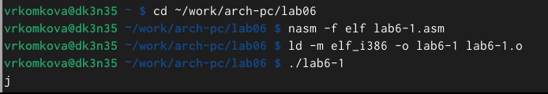{#fig:001 width=70%}

2. Изменила текст программы и вместо символов, записала в регистры числа

{#fig:002 width=70%}

3. Создала исполняемый файл и запустила его.

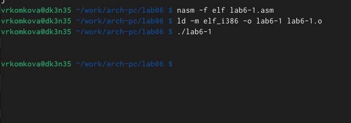{#fig:003 width=70%}

4. Создала файл lab6-2.asm в каталоге ~/work/arch-pc/lab06 и ввела в него текст программы.

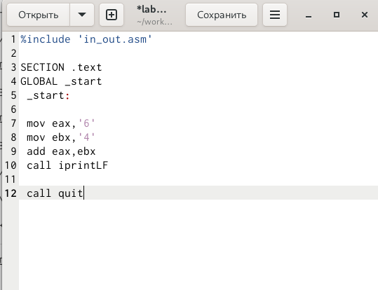{#fig:004 width=70%}

5. Создала исполняемый файл и запустила его.

{#fig:005 width=70%}

6. Изменила файл lab6-2.asm.

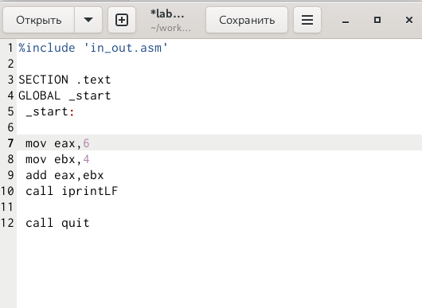{#fig:006 width=70%}

7. Создала исполняемый файл и запустила его.

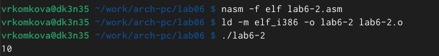{#fig:007 width=70%}

8. Заменила функцию iprintLF на iprint.

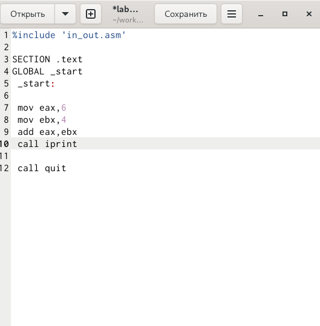{#fig:008 width=70%}

9. Создала исполняемый файл и запустила его.

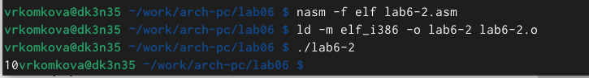{#fig:009 width=70%}

10. Cоздала файл lab6-3.asm в каталоге ~/work/arch-pc/lab06 

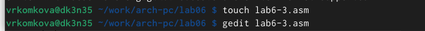{#fig:010 width=70%}

11. Заполнила lab6-3.asm,создала исполняемый файл и запустила его.

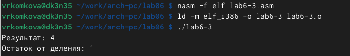{#fig:011 width=70%}

12. Изменил текст программы для вычисления выражения f(x) = (4*6+2)/5. Cоздала исполняемый файл и запустила его.

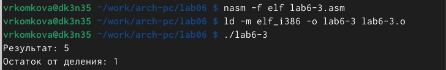{#fig:012 width=70%}

13. Создала файл variant.asm в каталоге ~/work/arch-pc/lab06. Заполнила variant.asm и создала исполняемый файл.

{#fig:013 width=70%}

14. Запустила исполняемый файл variant.asm. 

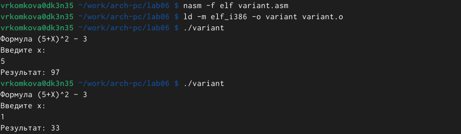{#fig:014 width=70%}

 Ответы на вопросы:
 1.Какие строки листинга 6.4 отвечают за вывод на экран сообщения ‘Ваш вариант:’? mov eax,rem call sprint 2.Для чего используется следующие инструкции? mov ecx, x mov edx, 80 call sread для полученния данных с клавиатуры 3. Для чего используется инструкция “call atoi”?
для преобразования ASCII кода в число 4. Какие строки листинга 6.4 отвечают за вычисления варианта?
    xor edx,edx
    mov ebx,20
    div ebx
    inc edx 5. В какой регистр записывается остаток от деления при выполнении инструкции “div ebx”? В edx 6. Для чего используется инструкция “inc edx”?
Увеличение edx на 1. 7. Какие строки листинга 6.4 отвечают за вывод на экран результата вычислений?
    mov eax,edx
    call iprintLF
 
 
 

# Выводы

Мне удалось освоить арифметические инструкции языка ассемблера в NASM.

# Список литературы{.unnumbered}

::: {#refs}
:::
